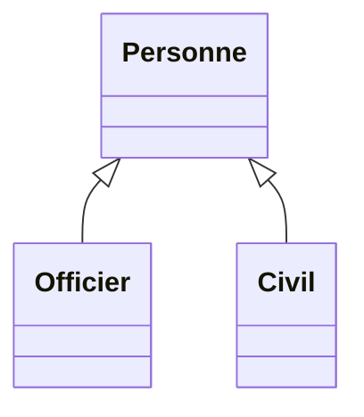
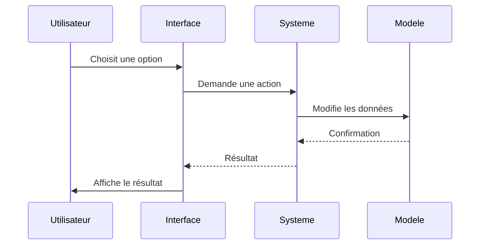

# 📘 Documentation de Conception - StarfleetReservation  
**Projet Java - Gestion d'une flotte spatiale**  
*Par [Votre Prénom Nom], Étudiant en Bac+2*

---

## 1. 🏗️ Structure du Projet

### Organisation des fichiers :
```
src/
├── main/java/strfleet/
│   ├── modele/          
│   ├── systeme/         
│   ├── ui/              
│   └── util/            
```

### Pourquoi cette organisation ?
- **Clarté** : Chaque dossier a un rôle précis
- **Facilité de maintenance** : On trouve rapidement les fichiers
- **Évolutivité** : On peut ajouter des fonctionnalités sans tout mélanger

---

## 2. 💡 Choix Principaux

### 2.1 Les Classes "Métier"
```java
// Exemple : La classe Vaisseau
public class Vaisseau {
    private String nom;
    private String immatriculation; 
    private int capacite;
    // ...
}
```
**Pourquoi ?**  
- Simple à comprendre
- Correspond bien à la réalité (un vaisseau a bien ces caractéristiques)

### 2.2 L'Héritage pour la classe Personne

**Avantages :**
- Évite de dupliquer le code (nom, prénom dans Personne)
- Permet d'ajouter des spécificités :
  - `Officier` a un rang et une spécialité
  - `Civil` a une planète d'origine

---

## 3. 🔄 Comment les Données sont Sauvegardées

### Méthode conseillée : Sérialisation
```java
// Pour sauvegarder :
ObjectOutputStream → Fichier "starfleet_data.dat"

// Pour charger :  
ObjectInputStream ← Fichier "starfleet_data.dat"
```

**Pourquoi ce choix ?**
- Facile à mettre en œuvre
- Garde tout l'état du programme
- Pas besoin de base de données complexe

---

## 4. 🎮 Comment Fonctionne le Programme

### Schéma d'Interaction :
1. L'utilisateur utilise `InterfaceControl` (les menus)
2. Qui appelle `SystemeReservation` (le "cerveau")
3. Qui modifie les objets métier (`Vaisseau`, `Mission`, etc.)



---

## 5. 🛠️ Difficultés Rencontrées

### Problème 1 : Gérer les dates
**Solution :**  
Utilisation de `SimpleDateFormat` pour :
- Lire les dates entrées par l'utilisateur
- Afficher les dates proprement

### Problème 2 : Les associations entre classes
**Exemple :** Un `Vaisseau` a des `Missions` et une `Mission` a un `Vaisseau`  
**Solution :**  
Méthodes pour bien synchroniser les deux côtés :
```java
// Dans Vaisseau :
public void ajouterMission(Mission m) {
    missions.add(m);
    m.setVaisseau(this);
}
```

---

## 6. 💭 Ce Que J'ai Appris

1. **Organisation du code** : Bien structurer ses classes
2. **Gestion des données** : Sauvegarde/chargement de fichiers
3. **UI textuelle** : Faire des menus clairs
4. **Java OO** : Héritage, interfaces, collections

---

## 7. 🔮 Améliorations Possibles

| Amélioration              | Complexité | Utilité |
|---------------------------|------------|---------|
| Interface graphique       | Moyenne    | +++     |
| Système de login          | Simple     | +       |
| Plus de validations       | Simple     | ++      |

*Exemple de validation à ajouter :*
```java
if (capacite <= 0) {
    throw new IllegalArgumentException("La capacité doit être positive");
}
```

---

Ce document montre comment j'ai conçu le projet étape par étape. J'ai choisi des solutions adaptées à mon niveau actuel en privilégiant la clarté et la fonctionnalité de base.  

 

*Documentation technique complète disponible dans les commentaires Javadoc du code.*